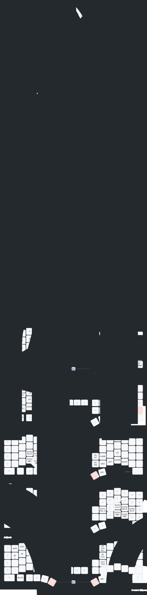

# My keymap

Generated by [Keymap Drawer · Streamlit](https://keymap-drawer.streamlit.app/)

## How to generate keymap image file

1. Upload [ZaruBall.keymap](../config/ZaruBall.keymap) in 'Keymap YAML section'.
2. Enable 'Layout override' and upload [info.json](../config/info.json) in 'Keymap visualization' section.
3. Download svg file in Export section and override [zaruball_my_keymap.svg](../image/zaruball_my_keymap.svg)
